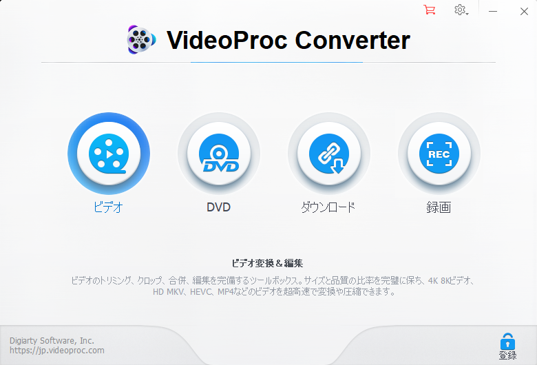
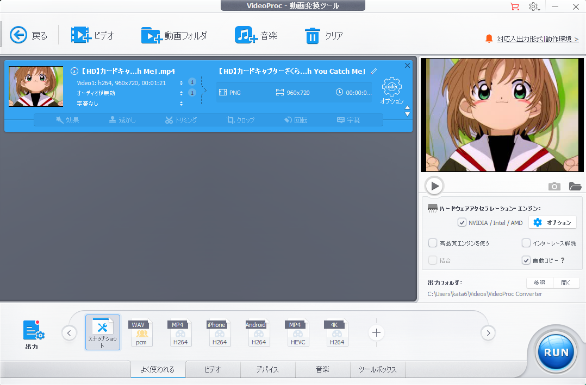
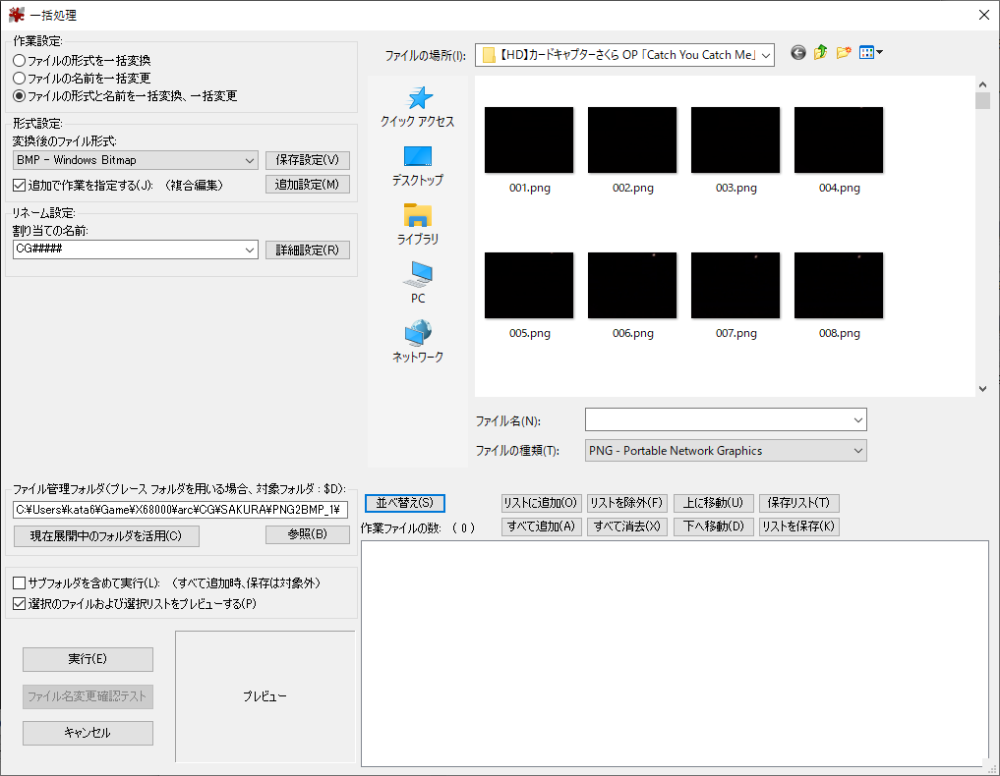
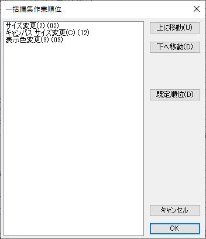

# 拡張グラフィックモードで動画(MACSデータ)を作ってみよう！

# 目次
1. [MACSとは？](#anchor1)
1. [MACSデータ作成補助ツール（MACScnv2.x)について](#anchor2)
1. [工程](#anchor3)
1. [必要な環境](#anchor4)
1. [リンク](#anchor5)
1. [手順](#anchor6)
	1. [動画ファイルを準備しよう！](#anchor6)
	1. [VideoProc Converterで動画ファイルから画像データ(PNG)を出力しよう！](#anchor7)
	1. [VideoProc Converterで動画ファイルから音声データ(WAV)を出力しよう！](#anchor8)
	1. [IrfanViewでリサイズ＆減色＆PNG→BMP変換しよう！](#anchor9)
	1. [MACSデータ作成補助ツール（MACScnv2.x)でMACSデータ作成バッチファイルを作成しよう！](#anchor10)
	1. [再生してみよう！](#anchor11)

MACSとは？
------------

#### MACSDRV.doc 引用

>MACSとはX680x0における'アニメーション'をもっと手軽に扱うために生まれた  
>常駐型のアニメーションコントローラです。

#### MACSDRV Version 1.16の勝手に改造 引用
>概要  
>MACSに以下の画面/音声モードを追加します。（要HIMEM.SYS互換IOCS＋ハイメモリ）  
>    -s0     256x256 65536色 (パレット保存無効)  
>    -s1     256x256 256色  
>    -s2     384x256 256色   (要IPLROM1.6)  
>    -s3     512x512 16色  
>    -s4     512x512 4色     (パレットは16色分保存)  
>    -s5     768x512 1色     (パレット保存無効)  
>    -s6     512x256 16色  
>    -s7     256x256 16色    (オリジナルMACSと同じ画面モードの改造版）  

>  PCM8A,PCM8ppが対応するすべての形式  

## MACSデータ作成補助ツール（MACScnv2.x)について
#### いきさつと目的
MACSデータは、プログラム(アセンブラ)＋画像データ＋音声データの組み合わせです。  
MACSデータ作りは大変なので、MACSデータ作成補助ツール（MACScnv2.x)を作りました。  
#### 概要
本ツール(MACScnv2.x)は、MACSデータを作るための補助ツールです。  
画像データと音声データを用意し、補助ツールが出力するバッチファイルを実行すれば、  
MACSデータが作れる仕組みになっています。  

------------
### 工程
MACSデータ作成には、下記の２工程があります。  

   1.***データ抽出 工程***  

Windows環境等で動画データから、画像データと音声データを抽出し、MACSデータの素材を準備します。  

   2.***データ加工 工程***  

| No. | バッチファイル名    | 概要                                    |
|-----|---------------------|-----------------------------------------|
| 0 | 00_MakeAll_Win.bat ※  | 下記BATファイルをWindowsから実行するためのBATファイル （Windowsで実行）|
| 1-1 | 0_MakeTxTp_Win.bat  | 画像処理(-s1,-s2のみ) （Windowsで実行） |
| 1-2 | 0_MakeTxTp.bat      | 画像処理               |
| 1-3 | 0_MakeTx.bat        | 画像処理(-s0,-s5のみ)  |
| 2   | 1_MakePCM.bat       | 音声データ変換  |
| 3   | 2_MakeLZSA_Win.bat  | 画像圧縮（Windowsで実行）  |
| 4   | 3_MakeMACS.bat      | アセンブル、リンク、MACSデータ作成  |

上記のようにMACSデータ作成補助ツール（MACScnv2.x)が、４つのバッチファイルを生成します。  
それを上から順番に実行してMACSデータを作ります。  
※XEiJを使えば、全てのBATファイルをWindowsから実行することが可能です。

### 必要な環境
WindowsとX68000間でデータのやり取りができること。
#### Windows ソフトウェア
| No.| ツール名            |Version | 概要                                |所在|
|----|---------------------|--------|-------------------------------------|----|
| 1  | VideoProc Converter | 5.0    |動画を画像データと音声データに分解  |インターネット|
| 2  | IrfanView           | 4.53   |複数の画像データを一括で加工できる  |インターネット|
| 3  | macscnv.exe         | 0.1.7  |MACS用BMP→Tx/Tp変換ツール v0.1 for Windows |X68K BBS|
| 4  | lzsa.exe            |        |データ圧縮                          |インターネット|

※AviUtlでもプラグインを活用すれば同等のことが可能です。要はX68000で表示出来るようにすればOK  

#### X68k ソフトウェア
| No.| ツール名         |Version | 概要                                |所在|
|----|------------------|--------|-------------------------------------|----|
| 1  | FLOATx.X         |x=2,3,4 | 浮動小数点型(float)が扱える         |システムディスクに同梱|
| 2  | (V)TwentyOne.sys |v1.36c+14 | 長いファイル名が扱える              |リンク参照|
| 3  | MACSDRV.x        |0.15.11 | 常駐型のアニメーションコントローラ  |X68K BBS|
| 4  | MakeMCS.x        |1.01    | MACSデータ生成                      |MACS116.LZHに同梱  |
| 5  | 060high.x        |0.10    | プログラムをhighメモリで実行        |リンク参照|
| 6 | HAS060.x         |3.09+89 | アセンブラ                          |リンク参照|
| 7 | hlk.r            |3.01+15 | リンカ                              |リンク参照|
| 8 | pcm3pcm.x        |2.15    | WAVからPCMへ変換する                |どこ？|
| 9 | MACScnv2.x        |2.01    | MACSデータ作成補助                  |X68K BBS|

※私の環境のオプション設定
DEVICE    = \DEV\060turbo\060turbo.sys -bs512 -cm1 -dv -ld4ma -lr -ls -lt -np -sd -ss -ts512 -xm

#### X68k ヘッダファイル
| No.| ファイル名       | 概要                |所在               |
|----|------------------|---------------------|-------------------|
| 1  | MACS_sch.h       | MACS用ヘッダファイル|MACSDRV Version 1.16の勝手に改造に同梱  |

#### X68k ハードウェア
本体：X68000+PhantomX(030,040,060モード）、X68030+060turbo、もしくは、エミュレータ XEiJ(060turbo)※    
メモリ：ハイメモリ128MB以上（推奨）  
拡張ボード：まーきゅりーゆにっと（推奨）  

※WindowsドライブをHFSでマウントして実施ください  
※Windowsドライブ上で作業するため、エミュレータXM6gでは、ご利用できません。  

### リンク

- [システムディスク](http://retropc.net/x68000/software/sharp/human302/):Makoto KamadaさんのX68000 LIBRARYのページ
- [MACSDRV](http://retropc.net/x68000/software/movie/macs/macsmoon/):Makoto KamadaさんのX68000 LIBRARYのページ
- [(V)TwentyOne](http://gorry.haun.org/x68index.html):GORRYさんの「ポリバケツＸ」...X680x0のページ
- [APICG](http://gorry.haun.org/x68index.html):GORRYさんの「ポリバケツＸ」...X680x0のページ
- [HAS](http://http://retropc.net/x68000/software/develop/as/has/):Makoto KamadaさんのX68000 LIBRARYのページ
- [hlk](https://github.com/kg68k/hlk-ev/releases/):立花@桑島技研さんのGitHub

## 手順

---
### 1. 動画ファイルを準備しよう！ 
VideoProc Converterの機能が便利です。 
体験版は、５分までの制約がありますが、X68000では扱いきれないサイズなので問題ありません。(笑)

---
### 2. VideoProc Converterで動画ファイルから画像データ(PNG)を出力しよう！ 
「ビデオ」を選択します。 
 
---
下のメニューから「スナップショット」を選択します。 
 
---
「画素数」を最大値になるように上げます。※直接入力ではなく、カーソルキー↑、PageUpがオススメ 
 
---
右下の「出力フォルダ」で適当な場所を選択し、「RUN」を押して画像を抽出します。 
 
---
PNGファイルが抽出されます。 
 

---
### 3. VideoProc Converterで動画ファイルから音声データ(WAV)を出力しよう！ 
下のメニューから「PCM」を選択します。 
 
---
オプションの変更は不要です。
 
---
WAVファイルが作成されるので、複製を作り「AD.WAV」にファイル名を変更ください。 
 

---
### 4. IrfanViewでリサイズ＆減色＆PNG→BMP変換しよう！ 
「ファイル」→「一括処理」 
 
---
「形式設定」→ BMP - Windows Bitmap 
「リネーム設定」→「CG#####」 #は５個 
「ファイル管理フォルダ」 →「変換後のファイルが保存されるところ」 
「ファイルの場所」→「PNGファイルが保存されている場所」 
「ファイルの種類」→ 「PNG - Portable Network Graphics 」 
 
---
「詳細設定」を押す 
「開始番号」→ 10000 
「加算数」 → 1 
 
---
「追加設定」を押す 
「サイズ変更」にチェックを入れる 
「横サイズ」256 
「アスペクト比を維持する 」にチェックを入れる 
「画像をリサンプルする」にチェックを入れる 
「256色」を選択する 
「キャンバスサイズ変更」にチェックを入れる 
 
------
「キャンバスサイズ変更」にチェックを入たら 
「設定確認」を押す
「Method1」の「Top side」「Bottom side」を広げる 
今回の例だと元画像が960x720の4:3の画像なので横幅を256にすると高さは192になります。 
256x192の画像から256x256にサイズを変更するには、 
高さが足りてないので上下32ピクセルずつ増やす。 
「Canvas Color」は、黒にしておきましょう。 
 
他に元画像が1280x720の16:9の画像は横幅を256にすると高さは144になります。 
256x144の画像から256x256にサイズを変更するには、 
高さが足りてないので上下56ピクセルずつ増やすようにします 
---
「すべて追加」を押して「作業ファイルの数」に登録する。 
「並べ替え」を押して、「混成の名前」を選択し、ファイル名が１から順番に並ぶようにする。 
 
---
「設定の作業順序で編集」にチェックを入れて「順位設定」を押す。
 
「サイズ変更」→「キャンバスサイズ変更」→「表示色変更」の順に設定する。
 
※「設定をファイルにて保存」で設定ファイルを保存するといいでしょう。
---
全て設定できたら「実行」を押す。
 
---
アスペクト比が保持されたBMP画像ができる。 
 

---
### 5. MACSデータ作成補助ツール（MACScnv2.x)でMACSデータ作成バッチファイルを作成しよう！ 
X68000のエミュレータを起動して、変換したBMPが置いてあるパスに移動する。 
MACScnv2.x、MACS_SCH.h、macscnv.exe、lzsa.exe xeijwin.dllをコピーしておく。 
変換で必要なツールは、バッチファイルのコマンドが実行できるようにPATH設定しておく。 
 
---
MACSデータ作成補助ツール（MACScnv2.x)を実行する。 
データのフォーマット  
>    -S0　256x256 65536色  
>    -S1　256x256 256色  (default)  
>    -S2　384x256 256色  
>    -S3　512x512 16色  
>    -S4　512x512 4色  
>    -S5　768x512 1色  
>    -S6　512x512 16色  
>    -S7　256x256 16色  
---
音声のフォーマット  
>    -M0　ADPCM only  
>    -M1　ADPCM+PCM 44kHz (default)  
>    -M2　ADPCM+PCM 22kHz  
---
フレームレート  
>    -F0　15.0   fps  
>    -F1　13.865 fps 31kHz  
>    -F2　18.486 fps 31kHz  
>    -F3　24.0   fps  
>    -F4　23.976 fps  
>    -F5　30.0   fps  
>    -F6　29.97  fps  
>    -F7　27.729 fps(default)  
>    -F8　55.458 fps  
>    -F数値  任意のfps ※   
      ex1: 20fpsの動画なら -F20    （S/W内で1000倍してます）  
      ex2: 28.456fpsの動画なら -F20456    
      ※数値は10より大きい値を入力ください   
---
タイトルとコメント  
>    -T <タイトル>  
>    -C <コメント>  
---
下記の例だと1944枚の256x256サイズの256色の画像と ADPCMとPCM 44kHzを使ったMACSデータを作るところ 
＜第一引数 ＞ 256x256 256色 
＜第二引数 ＞ ADPCM+PCM 44kHz 
＜第三引数 ＞ 24 fps   
　　　　　　　　　　　何故？-F3を選択したのか？ 1944[f]÷81[s]＝24[fps]より 
＜第四引数 ＞ CC_sakura_OP 
＜第五引数 ＞ moe 
＜第六引数 開始番号＞ 最初の画像ファイル名がCG10000なら10000 
＜第七引数 終了番号＞ 最後の画像ファイル名がCG11943なら11943 

実行するとバッチファイルとバイナリファイルリスト、アセンブラソースが作成される。 
 
-Tオプション、-Cオプションを使わなくても、後でMACSsrc.sをテキストエディタで開いてTITLEとCOMMENTを編集してもよい。 

※MACScnv2.x -q で実行すると、対話式でオプション設定できるようになったので、オプション設定を覚えてなくてもできます。(笑)
 

---
(自動で作る場合)  
XEiJの060turbo環境があれば、XEiJ起動後、HFSドライブからMACSの素材があるフォルダに移動してください。  
Windowsから「00_MakeAll_Win.bat」を実行すると、後は何もせず、MACSデータが作れるようになります。
 
---
(手動で作る場合)  
0_MakeTxTp_Win.batを実行して、MACSデータに必要な画像を作る。 
（_Win.batがつくファイル名は、Windowsのエクスプローラーから実行） 
選択オプション次第では、X68000で作業する必要あり 
 
超絶爆速！！
 
---
1_MakePCM.batを実行して、WAVファイルをADPCMとまーきゅりーゆにっとのデータに変換する 
 
---
2_MakeLZSA_Win.batを実行して画像を圧縮する。 
（_Win.batがつくファイル名は、Windowsのエクスプローラーから実行） 
 
こちらもそこそこ時間がかかるが、X68000で作業するよりも速い 
 
---
3_MakeMACS.batを実行して、アセンブル、リンク(コンバート)、MACSデータ化を行う 
MACSsrc.MCSファイルが作成される。  
※ここでハイメモリが必要になります。作成するデータの倍サイズのメモリが必要です。 
※ファイル名（MACSsrc.MCS）は、あとで適当にリネームしましょう。 
 

---
### 6. 再生してみよう！ 
#### MACSドライバを常駐しよう！
PCM8A.X もしくは、PCM8PP.Xを常駐させた後に、MACSDRV.Xを常駐する。 
 
#### 動画を再生しよう！
\>MACSplay.x MACSsrc.MCS 
 
動画が再生できたら完成です！ 
 
---
# おわり
